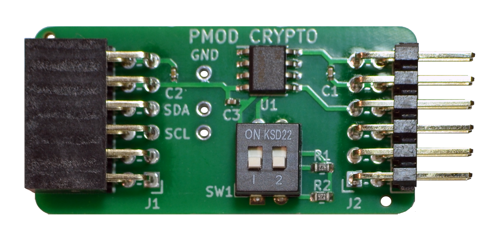
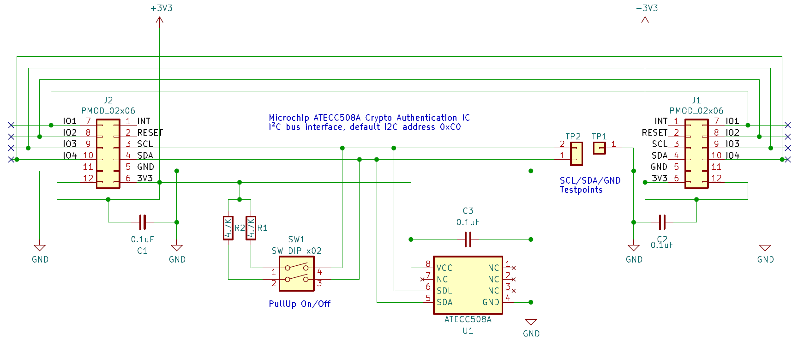
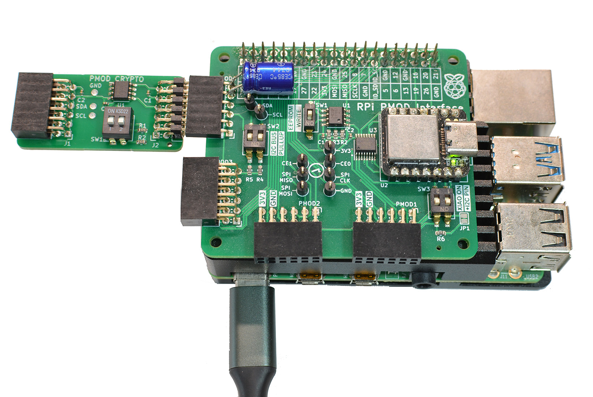

## CRYPTO PMOD

### Description



This PMOD connects the Microchip ATECC508A  crypto authentication device over I2C, 
using Digilent's PMOD interface type 6 and 6A per PMOD specification v1.3.1. 
The PMOD module can be chained to add additional I2C devices to the bus. 
The onborad I2C bus pull-up resistors can be enabled/disabled, using the DIP switch.

http://fpga.fm4dd.com/

### Schematic
](images/schema.png)

### PCB Gerber
[CRYPTO PMOD Gerber V1.0](20220624-crypto-gerber-v10.zip)

### PMOD Interface Pin Assignments

Pin  |	Label |	Description   | Pin  |	Label |	Description
-----|--------|---------------|------|--------|---------------
1    |	-     |	Not connected |7     | -      | Not connected
2    |	-     |	Not connected |8     | -      | Not connected
3    |	SCL   |	I2C clock     |9     | -      | Not connected
4    |  SDA   | I2C data      |10    | -      | Not connected
5    |  GND   | ground        |11    | GND    | ground
6    |  3V3   | 3.3V          |12    | 3V3    | 3.3V

All pins are passed through from connector J1 to J2, allowing to chain multiple type 6/6A PMODs.

### Example Operation

#### Linux / Raspberry Pi



Above shows the CRYPTO PMOD, connected to a [PMOD2RPI](https://github.com/fm4dd/pmod2rpi) interface board. When connected through the PMOD4 connector, the module can be controlled from the Raspberry Pi under Linux. Using i2cdetect, the ATECC508A IC responds under I2C bus address 0x60 (default).

```
pi@pi-ms05:~ $ i2cdetect 1
WARNING! This program can confuse your I2C bus, cause data loss and worse!
I will probe file /dev/i2c-1.
I will probe address range 0x08-0x77.
Continue? [Y/n]
     0  1  2  3  4  5  6  7  8  9  a  b  c  d  e  f
00:                         -- -- -- -- -- -- -- --
10: -- -- -- -- -- -- -- -- -- -- -- -- -- -- -- --
20: -- -- -- -- -- -- -- -- -- -- -- -- -- -- -- --
30: -- -- -- -- -- -- -- -- -- -- -- -- -- -- -- --
40: -- -- -- -- -- -- -- -- -- -- -- -- -- -- -- --
50: -- -- -- -- -- -- -- -- -- -- -- -- -- -- -- --
60: 60 -- -- -- -- -- -- -- -- -- -- -- -- -- -- --
70: -- -- -- -- -- -- -- --
```

To interact with the crypto IC under Linux, I am using "atecc-util", located at https://github.com/wirenboard/atecc-util.  This program is a frontend to the official Microchip library cryptoauthlib at https://github.com/MicrochipTech/cryptoauthlib.

Getting the client program:

```
pi@pi-ms05:~/atecc508a $ git clone https://github.com/wirenboard/atecc-util
Cloning into 'atecc-util'...
...
Receiving objects: 100% (351/351), 83.59 KiB | 2.88 MiB/s, done.
Resolving deltas: 100% (200/200), done.
```

Configure the I2C bus ID as 1, to match the RPI PMOD connection:

```
pi@pi-ms05:~/atecc508a/atecc-util $ vi config.h
#pragma once

#define DEFAULT_I2C_BUS 1
#define DEFAULT_I2C_SLAVE 0xC0

#define MAX_CMDS 32
```

Building the client program:

```
pi@pi-ms05:~/atecc508a $ cd atecc-util/
pi@pi-ms05:~/atecc508a/atecc-util $ git submodule init
pi@pi-ms05:~/atecc508a/atecc-util $ git submodule update
remote: Enumerating objects: 47, done.
remote: Counting objects: 100% (37/37), done.
remote: Total 47 (delta 36), reused 36 (delta 36), pack-reused 10
Unpacking objects: 100% (47/47), 12.65 KiB | 172.00 KiB/s, done.
From https://github.com/MicrochipTech/cryptoauthlib
 * branch              b976f640e4643a18876e0e5e600c8106f1bbe078 -> FETCH_HEAD
Submodule path 'cryptoauthlib': checked out 'b976f640e4643a18876e0e5e600c8106f1bbe078'
pi@pi-ms05:~/atecc508a/atecc-util $ make
...
```

Build result:

```
pi@pi-ms05:~/atecc508a/atecc-util $ ls -l ./atecc
-rwxr-xr-x 1 pi pi 439020 Jul  9 10:55 ./atecc
pi@pi-ms05:~/atecc508a/atecc-util $ ./atecc -h
atecc-util 0.4.7 (v0.4.7-dirty), build Jul  9 2022 10:54:59
Usage: ./atecc [-bshv] -c "cmd1 cmd1_args" [-c "cmd2 cmd2_args"]

        -b <i2c bus ID>
                I2C bus ID ATECC is connected to. Default is 9
        -s <i2c slave ID>
                I2C slave ID of ATECC. Default is 0xc0
        -c "cmd [arg1 [arg2 ...]]"
                Command and its arguments.
        -h[cmd_name]
                Print this help message or help message of specific command.
        -r <num_retries>
                Max number of retries for some commands. Default is 10
        -v      Print version and exit
```

Reading data from the crypto IC (factory-fresh  state):

```
pi@pi-ms05:~/atecc508a/atecc-util $ ./atecc -c 'info'
Found ATECC508A
pi@pi-ms05:~/atecc508a/atecc-util $ ./atecc -c 'serial'
0123**************
```

Below example dumps all configuration data (factory-fresh  state):

```
pi@pi-ms05:~/atecc508a/atecc-util $ ./atecc -c 'dump-config -'
============= Config zone dump: =============

000: 01         001: 23         002: 98         003: 3A
004: 00         005: 00         006: 50         007: 00
008: D8         009: 77         010: C6         011: 23
012: EE         013: C0         014: 31         015: 00
016: C0         017: 00         018: 55         019: 00
020: 83         021: 20         022: 87         023: 20
024: 8F         025: 20         026: C4         027: 8F
028: 8F         029: 8F         030: 8F         031: 8F
032: 9F         033: 8F         034: AF         035: 8F
036: 00         037: 00         038: 00         039: 00
040: 00         041: 00         042: 00         043: 00
044: 00         045: 00         046: 00         047: 00
048: 00         049: 00         050: AF         051: 8F
052: FF         053: FF         054: FF         055: FF
056: 00         057: 00         058: 00         059: 00
060: FF         061: FF         062: FF         063: FF
064: 00         065: 00         066: 00         067: 00
068: FF         069: FF         070: FF         071: FF
072: FF         073: FF         074: FF         075: FF
076: FF         077: FF         078: FF         079: FF
080: FF         081: FF         082: FF         083: FF
084: 00         085: 00         086: 55         087: 55
088: FF         089: FF         090: 00         091: 00
092: 00         093: 00         094: 00         095: 00
096: 33         097: 00         098: 33         099: 00
100: 33         101: 00         102: 1C         103: 00
104: 1C         105: 00         106: 1C         107: 00
108: 1C         109: 00         110: 1C         111: 00
112: 3C         113: 00         114: 3C         115: 00
116: 3C         117: 00         118: 3C         119: 00
120: 3C         121: 00         122: 3C         123: 00
124: 3C         125: 00         126: 1C         127: 00
===== Individual locks configuration ==
 Slot 00: unlocked
...
 Slot 15: unlocked

===== Slot configurations============
=========================  Slot: 0   ==================
Decoding SlotConfig value = 0x2083
Read key (except ECC private keys): 3
 If slot contains ECC private keys:
  External signatures of arbitrary messages are enabled: 1
  Internal signatures are enabled: 1
  ECDH operation is permitted for this key: 0
   ECDH master secret output mode: 0
NoMac bit: 0
LimitedUse bit: 0
EncryptRead bit: 0
IsSecret bit: 1
Write key: 0
Write config: 0x2 (hex) = 0010 (bin)
  Write cmd: Never
  DeriveKey cmd: Roll without MAC
  GenKey cmd: may be used
  PrivWrite cmd: Forbidden
-------------
Decoding KeyConfig value = 0x0033
Private bit: 1
PubInfo bit: 1
KeyType: 4 [P256]
Lockable bit: 1
ReqRandom bit: 0
ReqAuth bit: 0
AuthKey: 0
IntrusionDisable bit: 0
X509id: 0
...
=========================  Slot: 15   ==================
Decoding SlotConfig value = 0x8FAF
Read key (except ECC private keys): 15
 If slot contains ECC private keys:
  External signatures of arbitrary messages are enabled: 1
  Internal signatures are enabled: 1
  ECDH operation is permitted for this key: 1
   ECDH master secret output mode: 1
NoMac bit: 0
LimitedUse bit: 1
EncryptRead bit: 0
IsSecret bit: 1
Write key: 15
Write config: 0x8 (hex) = 1000 (bin)
  Write cmd: Never
  DeriveKey cmd: Can't be used
  GenKey cmd: may NOT be used
  PrivWrite cmd: Forbidden
-------------
Decoding KeyConfig value = 0x001C
Private bit: 0
PubInfo bit: 0
KeyType: 7 [SHA or other]
Lockable bit: 0
ReqRandom bit: 0
ReqAuth bit: 0
AuthKey: 0
IntrusionDisable bit: 0
X509id: 0
```